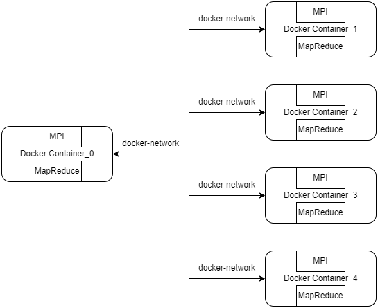
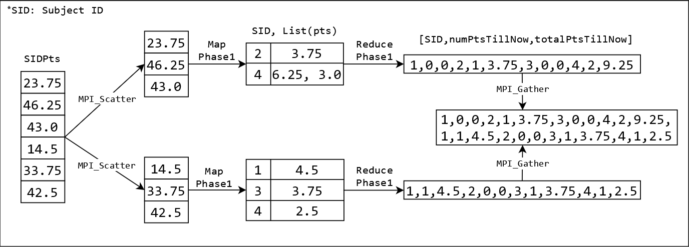
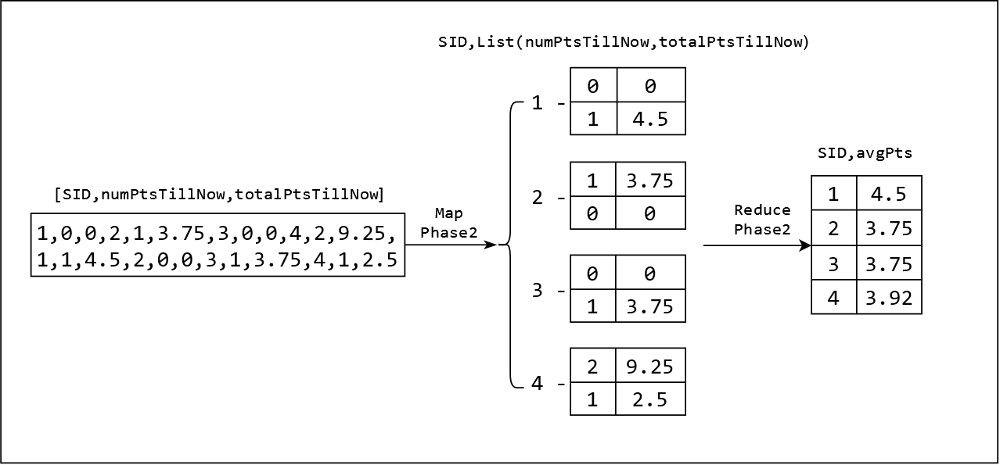
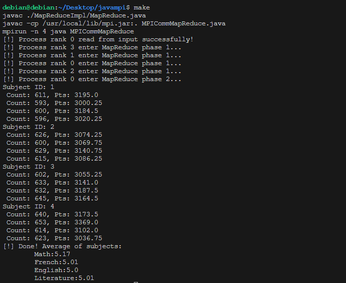

# Calculate Average Points using MapReduce + MPI
## Group Members

| Student Name      | Student ID |
| ----------------  | ---------- |
| Kieu Huy Hai      | BI12-149   |
| Vu Duc Hieu       | BI12-162   |
| Bui Cong Hoang    | BI12-169   |
| Ngo Quang Hung    | BI12-191   |
| Pham Khuong Cuong | BI12-070   |
| Hoang The Duy     | BI12-129   |

## Installation and Run

- Install `openjdk-17-jre` and `openjdk-17-jdk` using `apt`: `sudo apt-get install openjdk-17-jre openjdk-17-jdk -y`
- Download the source code (`.tar.gz` file) of the OpenMPI at the [homepage](https://www.open-mpi.org/software/ompi/v5.0/).
- In the source code folder after extracting, configure the source code: `./configure --enable-mpi-java` and install MPI: `make && make install`
- Add environment variable: `export LD_LIBRARY_PATH=/usr/local/lib`
- Run this project using `make`

## System Architecture

Our system will use 5 Docker containers to connect and communicate via a Docker network. Each container uses MPI to communicate in the network and uses the `MapReduce` model to achieve the goal: calculate the average point of each different subject from a large amount of input.  

  

In this context, the `MapReduce` task would be distributed across the Docker containers, with each handling a portion of the data processing, and the MPI processes within the containers would communicate with each other to do the `MapReduce` tasks, ensuring that data is correctly processed and aggregated.

## Algorithms

Our system will use 2 phases of `MapReduce`:

- Phase 1: Map from `SIDPts` to `SID, List(pts)` and reduce to an array of triplet `[SID, numPtsTillNow,totalPtsTillNow]`:
  
- Phase 2: Map from the array `[SID, numPtsTillNow,totalPtsTillNow]` to `SID, List(numPtsTillNow,totalPtsTillNow)` and reduce to `[SID, avgPts]`:
  

## Scenario and Demonstration

### Scenario

Calculate the average point for 4 subjects: **Math**, **English**, **French** and **Literature** in the National High School Graduation Examination (We will use the points from the CSV file [here](input.csv))

### Demo

